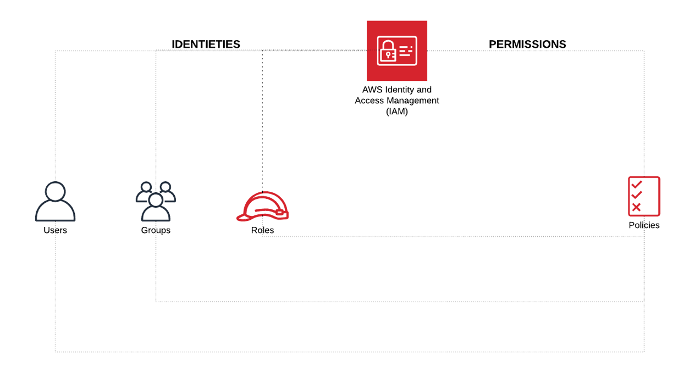

# IDENTITY AND ACCESS MANAGEMENT

## LAB PURPOSE

Learn basic setup of users, policies and groups via IAM

## DEFINITIONS
----

### IAM Users

The IAM user represents the person or service who uses the IAM user to interact with AWS

### IAM Groups

An IAM group is a collection of IAM users. 

### IAM Roles 

Identity that determine what the identity can and cannot do in AWS, does not have any credentials (password or access keys) associated with it.

## STEPS
---

1. CREATE POLICIES
    * Go to **IAM** section in the AWS console.
    * Click on  **Policies** and **Create policy**.
    * Click on **Choose a service**.
    * Search for **S3** and select it.
    * Select **All S3 actions (s3:\*)**
    * Click on **Resources** and select **All resources**
    * Click on **Review policy**
    * Name the policy with **S3FullAccess**
    * Click **Create policy**

2. CREATE GROUPS
    * Go to **IAM** section in the AWS console.
    * Click on  **Groups** and **Create New Group**.
    * Name the group with **S3FullAccess** and press **Next Step**
    * Search for **S3FullAccess** policy previously created and select it.
    * Click on **Next Step** and **Create Group**.
    * Click on  **Groups** and **Create New Group**.
    * Name the group with **Admins** and press **Next Step**
    * Search for **AdministratorAccess** policy and select it.
    * Click on **Next Step** and **Create Group**.

3. CREATE USERS
    * Go to **IAM** section in the AWS console.
    * Click on  **Users** and **Add user**.
    * Name the user with **admin**, select **Programatic access** and **AWS Management Console access**.
    * Click **Next: Permissions**.
    * Select **Admins** and click on **Next: Tags**.
    * Click on **Next: Review**.
    * Click on **Create User**.
    * Click on  **Users** and **Add user**.
    * Download generated credentials.
    * Name the user with **basicuser**, select **Programatic access** and **AWS Management Console access**.
    * Click **Next: Permissions**.
    * Select **S3FullAccess** and click on **Next: Tags**.
    * Click on **Next: Review**.
    * Click on **Create User**.
    * Download generated credentials.

4. LOGIN WITH BASICUSER
    * Login to AWS Console with previously created **basicuser**
    * Go to **IAM** section in the AWS console.
    * Try to policy as in step 1 of the lab.
